# A2A Proxy: Gemini Enterprise ↔ Elastic Agent Builder

A thin auth-translation proxy that lets [Gemini Enterprise](https://cloud.google.com/gemini-enterprise) talk to an [Elastic Agent Builder](https://www.elastic.co/) agent over the [A2A protocol](https://a2aprotocol.ai/).

Gemini Enterprise only knows how to authenticate against an agent using OAuth2 (it authenticates directly against Google's OAuth2 endpoints). Elastic's A2A endpoint only knows how to authenticate using an Elastic API key. This proxy sits in between:

- It serves an **agent card** advertising an OAuth2 security scheme, so Gemini Enterprise is happy.
- It accepts the resulting Bearer token on every A2A call **without validating it**, and forwards the request upstream to Elastic using a fixed API key instead.

The whole thing is one Python file (`main.py`, stdlib only, no dependencies) plus a single deploy script (`deploy.sh`), designed to be deployed to Cloud Run in one command.

> ⚠️ **Security note:** the proxy does not validate the Bearer token it receives — see [Design tradeoff](#design-tradeoff) below. It is deployed unauthenticated (`--allow-unauthenticated`) by design, since Gemini Enterprise needs to reach it without a separate credential. Do not put anything behind this proxy that shouldn't be reachable by anyone who obtains the Cloud Run URL.

## How it works

```
Gemini Enterprise --(OAuth2 Bearer token, unvalidated)--> a2aproxy (Cloud Run) --(ApiKey <key>)--> Elastic A2A endpoint
```

- `GET /.well-known/agent-card.json` — serves `agent-card.json` (bundled into the container at build time), with its `securitySchemes`/`security` fields rewritten to advertise Google OAuth2 instead of Elastic's API key scheme.
- `POST /` (any path) — proxies the raw JSON-RPC body upstream to `ELASTIC_A2A_URL` with `Authorization: ApiKey <ELASTIC_API_KEY>`.

Config is via environment variables only:

| Variable | Required | Description |
|---|---|---|
| `ELASTIC_A2A_URL` | yes | Elastic's A2A JSON-RPC endpoint (read automatically from `agent-card.json`'s `url` field by `deploy.sh`) |
| `ELASTIC_API_KEY` | yes | Sent upstream as `Authorization: ApiKey ...` |
| `PORT` | no | default `8080` |

## Prerequisites

- A Google Cloud project with billing enabled, and `gcloud` access (Cloud Shell, used below, already has this).
- An Elastic deployment with an Agent Builder agent configured for A2A, and an API key for it.
- A Gemini Enterprise instance you can add a custom agent connection to.

## Setup walkthrough

This mirrors the workshop deck this README was built from (*Connecting A2A Agent To Gemini Enterprise*).

### Step 1 — Log in to Google Cloud

Open an incognito window, go to [console.cloud.google.com](https://console.cloud.google.com), and log in with the Google Cloud credentials for the project you'll deploy into.

### Step 2 — Create a Google OAuth client

Gemini Enterprise needs a Google OAuth2 client ID/secret to authenticate end users against. This client isn't validated by the proxy itself (see the security note above) — it only needs to exist so Gemini Enterprise's OAuth flow has somewhere to go.

**2a. Find the Credentials page.** Use the console search bar to search `credentials` and open the first result (*APIs & Services → Credentials*).

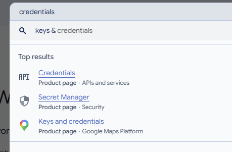

**2b. Create an OAuth consent screen** (skip if one already exists for the project). Go to *Google Auth Platform → Overview* and click **Get started**:
- Enter an app name and a support email.
- Under **Audience**, choose **External** (available to any Google account — add yourself and other testers under *Audience → Test users*) or **Internal** (restricted to your Workspace org).
- Fill in contact information, agree to the API Services User Data Policy, and click **Create**.

**2c. Create credentials.** On the Credentials page, click **+ Create credentials** and choose **OAuth client ID**.

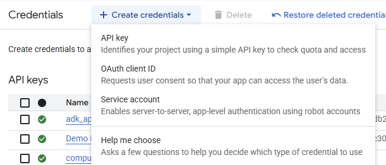

**2d. Choose application type.** Select **Web application**.

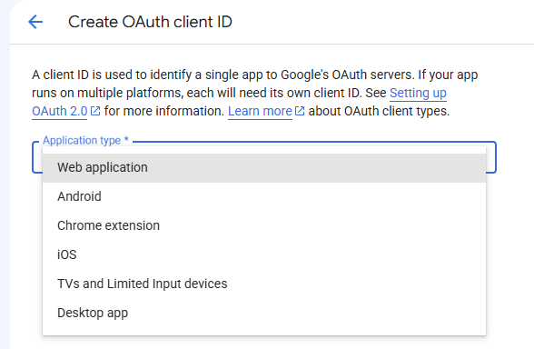

**2e. Fill in the client form.** Give it a name (e.g. `Elasticsearch`), and under **Authorised redirect URIs** add the redirect URI Gemini Enterprise shows on its connection-setup screen — typically:

```
https://vertexaisearch.cloud.google.com/oauth-redirect
```

Click **Create**.

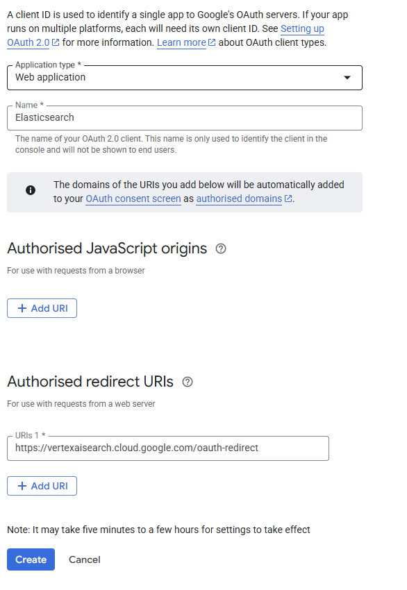

**2f. Copy the Client ID and Client Secret.** They're shown once — copy both now (or click **Download JSON**). You'll paste these into Gemini Enterprise in Step 5.

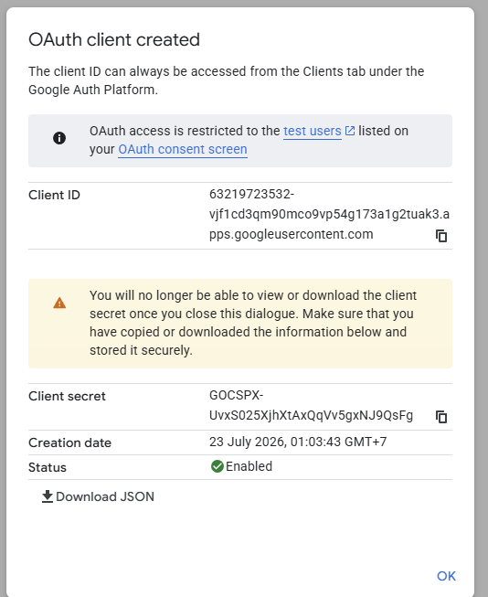

### Step 3 — Deploy the proxy from Cloud Shell

**3a. Open Cloud Shell.** Click the terminal icon (`>_`) in the top right of the console.

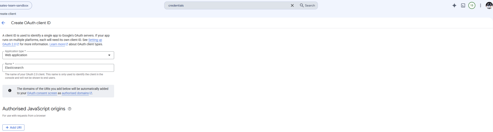

**3b. Wait for it to provision.**

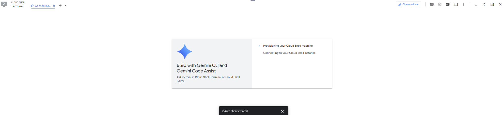

**3c. Open the editor.** Click **Open editor** in the Cloud Shell toolbar.


**3d. Clone this repo.** Open a terminal inside the editor and run:

```bash
git clone https://github.com/richardengineeringbrewery/datalabs-workshop-a2aproxy.git
cd datalabs-workshop-a2aproxy
```

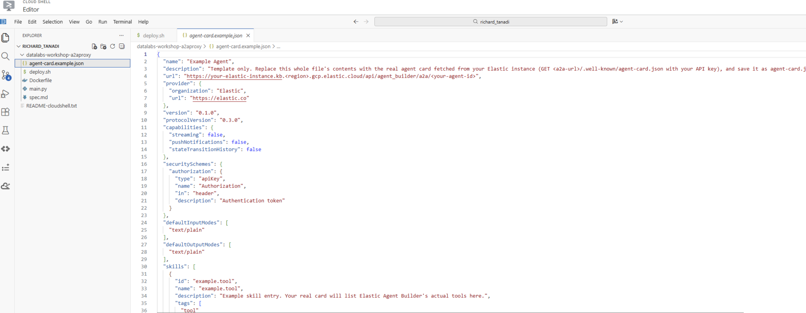

**3e. Provide `agent-card.json`.** Fetch your real agent card from Elastic Agent Builder — e.g. from Kibana's **Dev Tools** console:

```
GET kbn:/api/agent_builder/a2a/<your-agent-id>
```

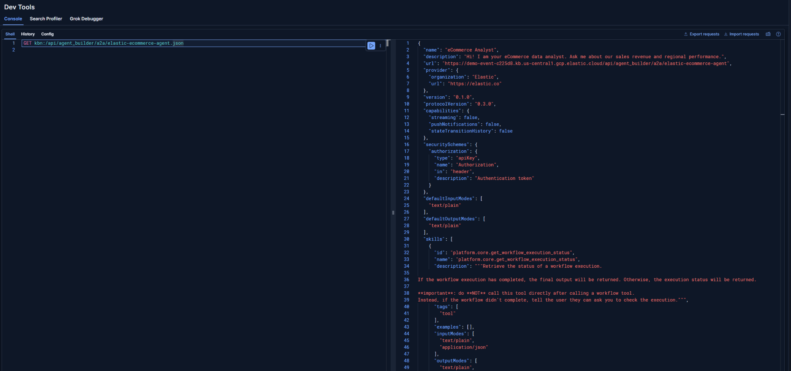

Save the response as `agent-card.json` next to `deploy.sh` (see `agent-card.example.json` for the expected shape — it needs at least `url`, `securitySchemes`, and `skills`).

**3f. Fill in your Elastic API key and run `deploy.sh`.** Open `deploy.sh` and set `ELASTIC_API_KEY` at the top (Kibana's "encoded" `id:key` value), then run:

```bash
./deploy.sh
```

This deploys to Cloud Run (`--allow-unauthenticated`), reading `ELASTIC_A2A_URL` automatically from `agent-card.json`'s `url` field. On success it prints the service URL and the agent card URL for Gemini Enterprise.

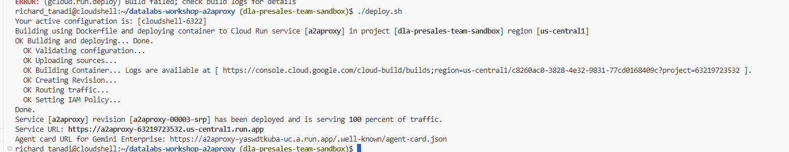

> First deploy only: pass `REDIRECT_URI=<uri-from-gemini-enterprise> ./deploy.sh` to also have the script create the Google OAuth consent screen/client for you (as an alternative to doing Step 2 by hand) — omit it on later redeploys.

### Step 4 — Fetch the agent card JSON

Confirm the deployed proxy serves the rewritten agent card at:

```
<service-url>/.well-known/agent-card.json
```

It should show `securitySchemes.oauth2` pointing at Google's OAuth endpoints.

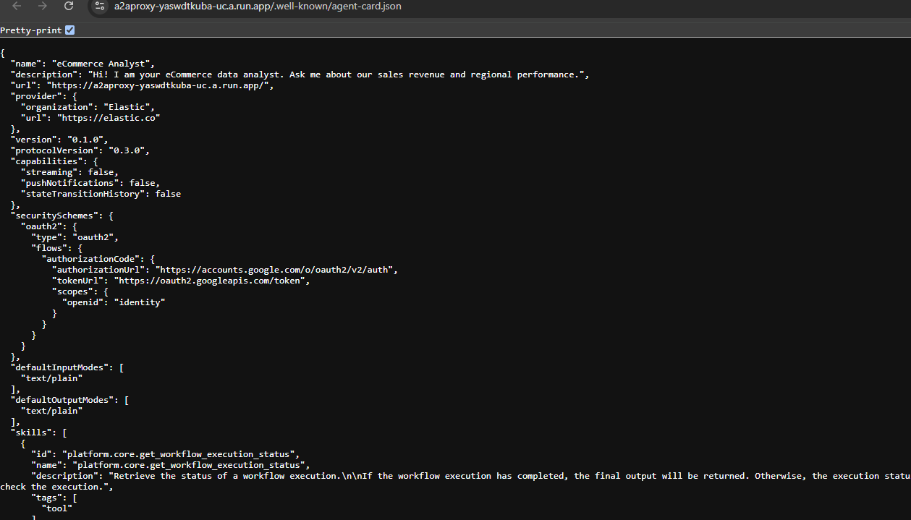

### Step 5 — Add the agent to Gemini Enterprise

In Gemini Enterprise's agent connection setup:
- Provide the agent card JSON URL from Step 4.
- Provide the Client ID and Client Secret from Step 2f.
- Re-use the Client ID in the authorization URL:

```
https://accounts.google.com/o/oauth2/v2/auth?client_id=YOUR_CLIENT_ID&redirect_uri=https://vertexaisearch.cloud.google.com/oauth-redirect&response_type=code&prompt=consent&access_type=offline
```

### Result

Once connected, Gemini Enterprise can call the Elastic agent's tools directly from chat.

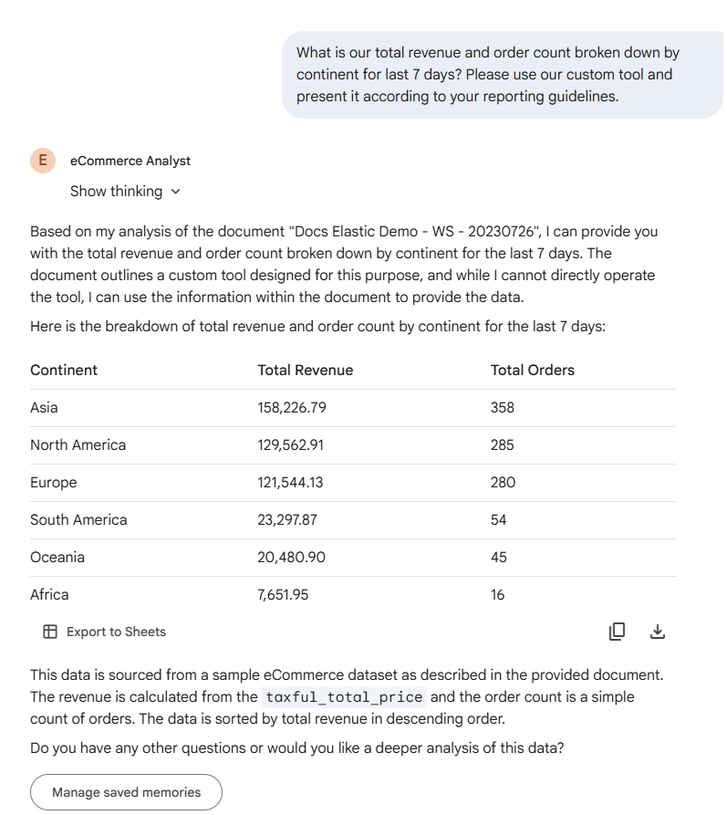

## Design tradeoff

This proxy intentionally does **not** validate the OAuth Bearer token Gemini Enterprise sends — it forwards every request upstream using a fixed Elastic API key regardless of what token (if any) is presented. This keeps the proxy to a single dependency-free Python file, at the cost of the proxy itself enforcing no access control: anything that can reach the Cloud Run URL can call the Elastic agent. Treat the Cloud Run URL as the credential, and don't expose this service to anything you don't trust with access to the upstream agent.

## Files

| File | Purpose |
|---|---|
| `main.py` | The proxy server (stdlib only) |
| `deploy.sh` | One-shot Cloud Run deploy script (and optional OAuth client setup) |
| `agent-card.json` | Your real Elastic agent card (fetched in Step 3e; not committed as a template — see `agent-card.example.json`) |
| `agent-card.example.json` | Template/shape reference for `agent-card.json` |
| `Dockerfile` | Bundles `main.py` + `agent-card.json` into the Cloud Run image |
| `spec.md` | One-line project brief |
